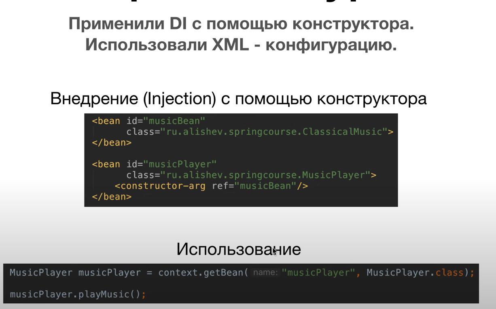
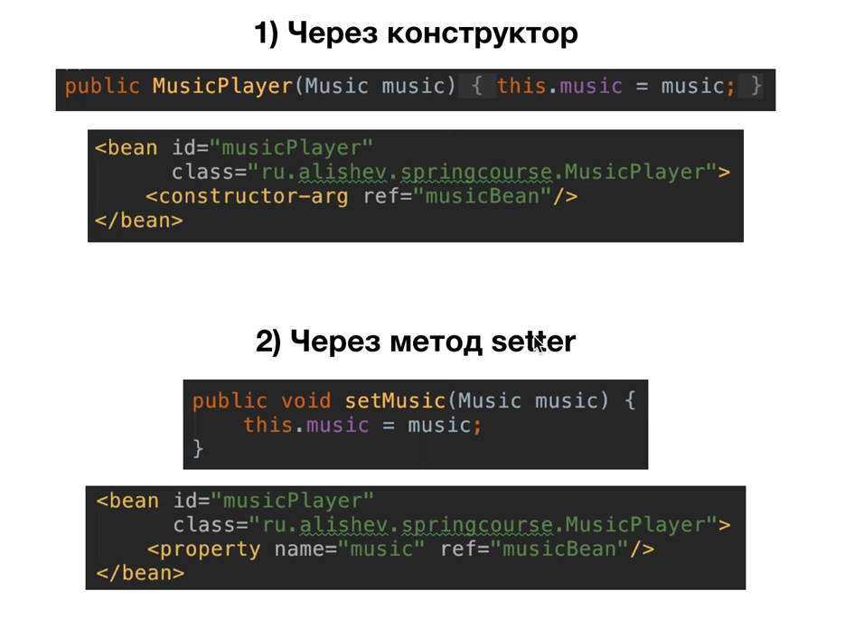
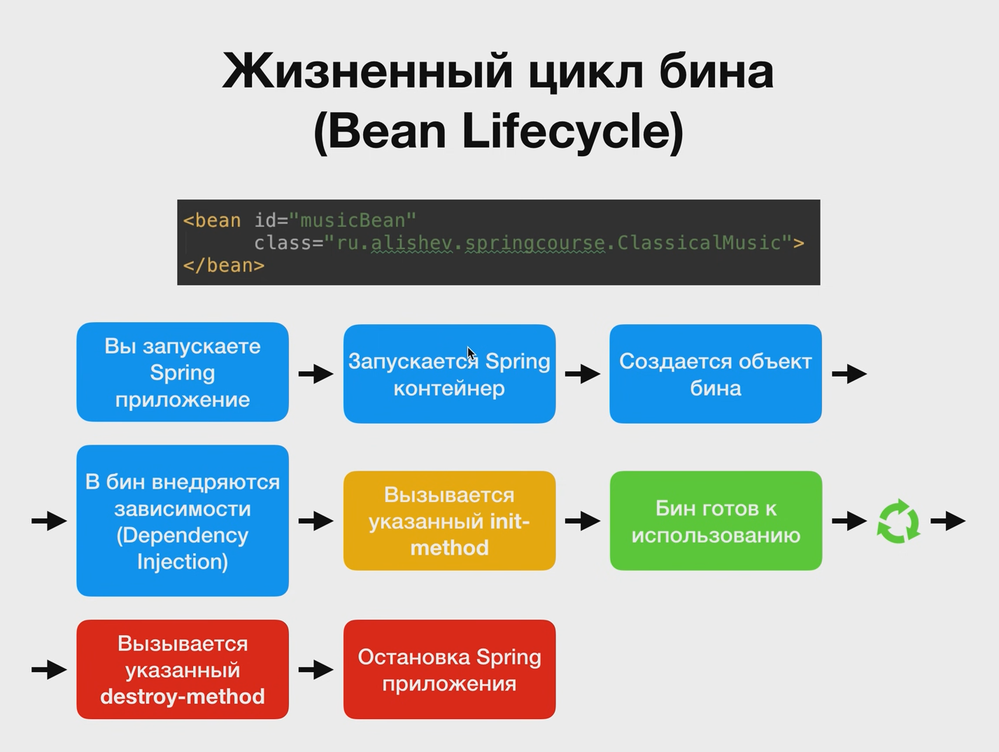

## lesson 2
- Настройка конфигурационного файла
- Первый запуск приложения

## lesson 4
- Работа над Inversion of Control
- Работа с имплементацией и созданием как самих объектов, так и зависимостей через интерфейсы
  - ДЗ: создать еще один жанр музыки

## lesson 5
- Работа над **Dependency Injection**(Внедрение зависимостей) через КОНСТРУКТОР
- Теперь зависимости внедряются не вручную, а с помощью конфигурационного файла, бины все делают сами

Вместо:
```
Music music = context.getBean("musicBean", Music.class);
MusicPlayer musicPlayer = new MusicPlayer(music);
```
Делаем:
```agsl
<bean id="musicPlayer"
          class="org.example.MusicPlayer">
        <constructor-arg ref="musicBean"/>
    </bean>
```
1) Spring изначально создает Beans, в даннос случае `class="org.example.RockMusic"`
2) Затем Spring создает Bean `class="org.example.MusicPlayer">` и передает ему по ссылке `<constructor-arg ref="musicBean"/>`



## lesson 6
- Работа над **Dependency Injection**(Внедрение зависимостей) через SETTER
- В классе MusicPlayer добавлен сеттер и конструктор по умолчанию
- Соттвестванно изменены `<constructor-arg ref="musicBean"/>` на `<property name="music" ref="musicBean"/>`
- ВАЖНО: здесь все еще внедряется ссылочное значение 
- Передача параетров в setter, назначение атрибутов через DI

  - ДЗ:
    - Добавить Список проигрываемых композиций
    - Добавить Setter для устновки знчений
    - Изменить или переопределить метод, выводящий список воспроизводимой музык
    - Досоздавать классы альтернативной музыки
    - Внедрить зависимость, передав список
```agsl
<bean id="musicPlayer"
          class="org.example.MusicPlayer">
        <property name="musicList">
            <list>
                <ref bean="musicBean1"/>
                <ref bean="musicBean2"/>
                <ref bean="musicBean3"/>
            </list>
        </property>

        <property name="name" value="${musicPlayer.name}"/>
        <property name="volume" value="${musicPlayer.volume}"/>
    </bean>
```

## lesson 7
- область видимости бинов SCOPE
- используется паттерн Singleton - тогда разные объекты ссылаются на один
- при использовании `scope="prototype"` создаются разные объекты, тогда:
```
MusicPlayer firstMusicPlayer = context.getBean("musicPlayer", MusicPlayer.class);
        MusicPlayer secondMusicPlayer = context.getBean("musicPlayer", MusicPlayer.class);

        boolean comparation = firstMusicPlayer == secondMusicPlayer;
        System.out.println(comparation);
        System.out.println(firstMusicPlayer);
        System.out.println(secondMusicPlayer);

        firstMusicPlayer.setVolume(5500);

        System.out.println(firstMusicPlayer.getVolume());
        System.out.println(secondMusicPlayer.getVolume());
```
Получится вывод:
```agsl
false
org.example.MusicPlayer@3ce1e309
org.example.MusicPlayer@6aba2b86
5500
100
```

## lesson 8
- жизненный цикл метода выглядит так:

- init-method
  - инициализаци ресурсов, подключение к БД, обращение к внешним файлм
- destroy-method
  - очищение ресурсов, зачистка и закрытие потоков ввода-вывода

Описание работы с методами:
- Мы можем сами создать методы инициализации и разрушения. Методы должны быть void, без параметров...
Инициализируем методы:
```agsl
    public void doMyInit(){
        System.out.println("Do my initialization");
    }

    public void doMyDestroy(){
        System.out.println("Bean was destroyed");
    }
```
В applicationContext.xml мы указываем на названия методов:
```agsl
<bean id="musicBean"
          class="org.example.ClassicalMusic"
          init-method="doMyInit"
          destroy-method="doMyDestroy"
    >
    </bean>
```

Так же можно использовать паттерн **Factory-method**, который запрещает использование new для создания новых объектов
- Создаем приватный конструктор `private ClassicalMusic(){}` и публичный статичный метод инициализции объекта:
```agsl
public static ClassicalMusic getClassicalMusic(){
        return new ClassicalMusic();
    }
```
И указать в applicationContext.xml `factory-method="getClassicalMusic"`